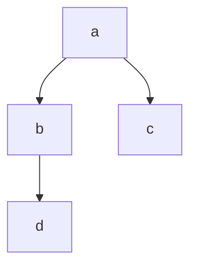

- 流程图

- ```c
  graph TD;	// graph 关键字 声明一张流程图， TD 表示的是方向 Top->Down
  a-->b;		
  a-->c;
  b-->d;
  ```




- 时序图

- ```c
  sequenceDiagram
      Alice->>John : hello John, how Are You?
      John->>Alice : Great!    
          //sequenceDiagram 表示时序图
          // ->> 表示实现箭头
          // -->> 则表示虚线
  ```

  ```mermaid
  sequenceDiagram
  Alice->>JoHn : hello John, how Are You ?
  JoHn ->>Alice : Great!
  ```

- 状态图

- ```mermaid
  stateDiagram
  	[*] --> s1
  	s1 --> [*]
  ```

- 

