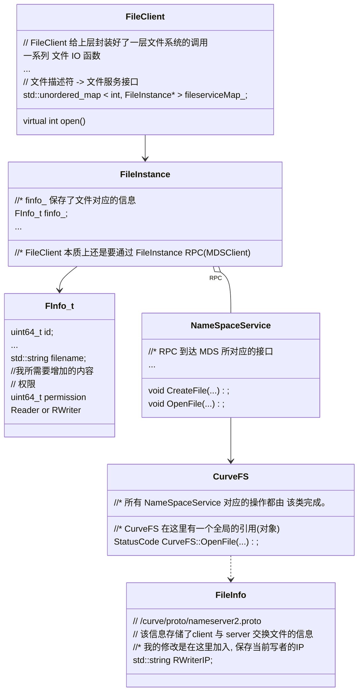

namespace_service.h / cpp OpenFile()

​	curvefs.h / cpp OpenFile

​		curvefs.h / cpp GetFileInfo WalkPath and LookUpFile

​			namespace_storage.cpp NameServerStorageImp::GetFile() 

​				std::string out 这里其实就已经获得了fileinfo 后续的东西