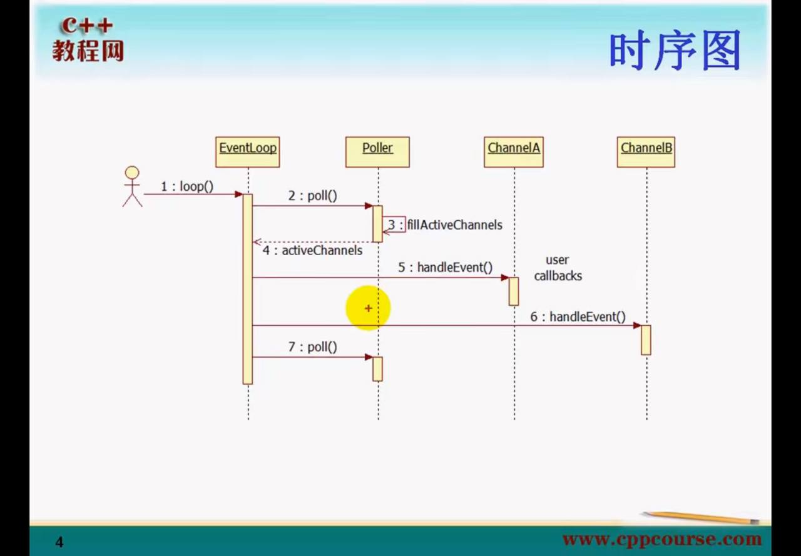

- loop 函数调用后，会调用 poll  


- muduo 一个 EventLoop 会包含多个Channel (通道) ,std::vector<Channel*>,那么为了当便处理这些事件，
- muduo采用了 IO 多路复用的机制，在这里muduo头一次采用了面向对象的思想，这里使用了 纯虚基类 Poller,
```c++
class Poller : noncopyable
{
public:
	typedef std::vector<Channel*> ChannelList;
	virtual ~Poller();
	virtual Timestamp poll(int timeoutMs, ChannelList* activeChannels) = 0;
	// 更新通道
	virtual void updateChannel(Channel* channel) = 0;
	// 移除通道
	virtual void removeChannel(Channel* channel) = 0;
	// 是否拥有通道
	virtual bool hasChannel(Channel* channel ) const;
protect:
	// int 指的是文件描述符
	typedef std::map<int, Channel*> ChannelMap;
	ChannelMap channels;
private:
	EventLoop* ownerLoop_;
};
```
在 muduo/net/poller 中有着对poll的继承。
让我们一起看看吧。
- PollPoller
```c++
class PollPoller : public Poller
{
	public:
		...
		Timestamp poll(int timeoutMs, ChannelList* activeChannels) override;
		void updateChannel(Channel* channel) override;
		void removeChannel(Channel* channel) override;
 	private:
		void fillActiveChannels(int numEvents, ChannelList* activeChannels) const;
		typedef std::vector<struct pollfd> PollFdList;
		PollFdList pollfds_;
};
```
- poll()
```c++
Timestamp PollPoller::poll(int timeoutMs, ChannelList* activeChannels)
{
  // XXX pollfds_ shouldn't change
	// 由于poll函数需要传入一个数组，所以poller中保存着一个vector
	// 返回就绪文件描述符的个数
  int numEvents = ::poll(&*pollfds_.begin(), pollfds_.size(), timeoutMs);
  int savedErrno = errno;
  Timestamp now(Timestamp::now());
  if (numEvents > 0)
  {
    LOG_TRACE << numEvents << " events happened";
    fillActiveChannels(numEvents, activeChannels);
  }
  else if (numEvents == 0)
  {
    LOG_TRACE << " nothing happened";
  }
  else
  {
    if (savedErrno != EINTR)
    {
      errno = savedErrno;
      LOG_SYSERR << "PollPoller::poll()";
    }
  }
  return now;
}
```
- 这里呢，poll 返回就绪的文件描述符之后，又会调用 fillActiveChannels,将可读文件描述符填充进去。让我们一起看看吧
- 提示
	- events：表示要告诉操作系统需要监测fd的事件（输入、输出、错误），每一个事件有多个取值
	- revents：revents 域是文件描述符的操作结果事件，内核在调用返回时设置这个域。events 域中请求的任何事件都可能在 revents 域中返回。
```c++
void PollPoller::fillActiveChannels(int numEvents, ChannelList* activeChannels) const
{
  //  遍历整个 private std::vector<struct pollfd> pollfds_;
  for (PollFdList::const_iterator pfd = pollfds_.begin();
      pfd != pollfds_.end() && numEvents > 0; ++pfd)
  {
    if (pfd->revents > 0)
    {
      // 每处理一个，事件数 -1
      --numEvents;
			
      ChannelMap::const_iterator ch = channels_.find(pfd->fd);
      assert(ch != channels_.end());
      Channel* channel = ch->second;
      assert(channel->fd() == pfd->fd);
      // 将该套接字所对应的channel 的 revents_ = revt;
      // 更新事件？
      channel->set_revents(pfd->revents);
      // pfd->revents = 0;
      // 加入到对应的EventLoop 活跃的通道(Channel) 中
      activeChannels->push_back(channel);
    }
  }
}
```
- 在更新完活跃的通道之后，那么就要调用 handleEvent 对逐个通道进行处理。我们来看一下 handleEvent 吧 muudo/net/EventLoop.cc
	- 在这里呢？ tied_ 涉及到一些生命周期的问题，此处先跳过，读者可直接认为这里直接调用 handleEventWithGuard();
```c++
void Channel::handleEvent(Timestamp receiveTime)
{
  std::shared_ptr<void> guard;
  if (tied_)
  {
    guard = tie_.lock();
    if (guard)
    {
      handleEventWithGuard(receiveTime);
    }
  }
  else
  {
    handleEventWithGuard(receiveTime);
  }
}
```
- handleEventWithGuard()
	- 提示 : poll 中很多宏都被 epoll 所继用，所以这里在 EventLoop 中直接使用 poll 的宏是完全没有问题的。
```c++
void Channel::handleEventWithGuard(Timestamp receiveTime)
{
	// eventHandling_ 表示是否处于处理事件中
  eventHandling_ = true;
	// 将事件转化为字符串并且写入日志。
  LOG_TRACE << reventsToString();
	// 当该revents_被挂起 并且没有数据可读时
  if ((revents_ & POLLHUP) && !(revents_ & POLLIN))
  {
    if (logHup_)
    {
      LOG_WARN << "fd = " << fd_ << " Channel::handle_event() POLLHUP";
    }
	  // 表明该套接字需要被关闭，如果关闭回调函数存在，则调用
    if (closeCallback_) closeCallback_();
  }
	// 如果文件描述符没有被打开，就打印警告日志
  if (revents_ & POLLNVAL)
  {
    LOG_WARN << "fd = " << fd_ << " Channel::handle_event() POLLNVAL";
  }
	// 触发错误回调函数
  if (revents_ & (POLLERR | POLLNVAL))
  {
    if (errorCallback_) errorCallback_();
  }
	// 触发可读回调函数
  if (revents_ & (POLLIN | POLLPRI | POLLRDHUP))
  {
    if (readCallback_) readCallback_(receiveTime);
  }
	// 触发可写回调函数
  if (revents_ & POLLOUT)
  {
    if (writeCallback_) writeCallback_();
  }
	// 当前channel处于非处理事件过程中
  eventHandling_ = false;
}
```