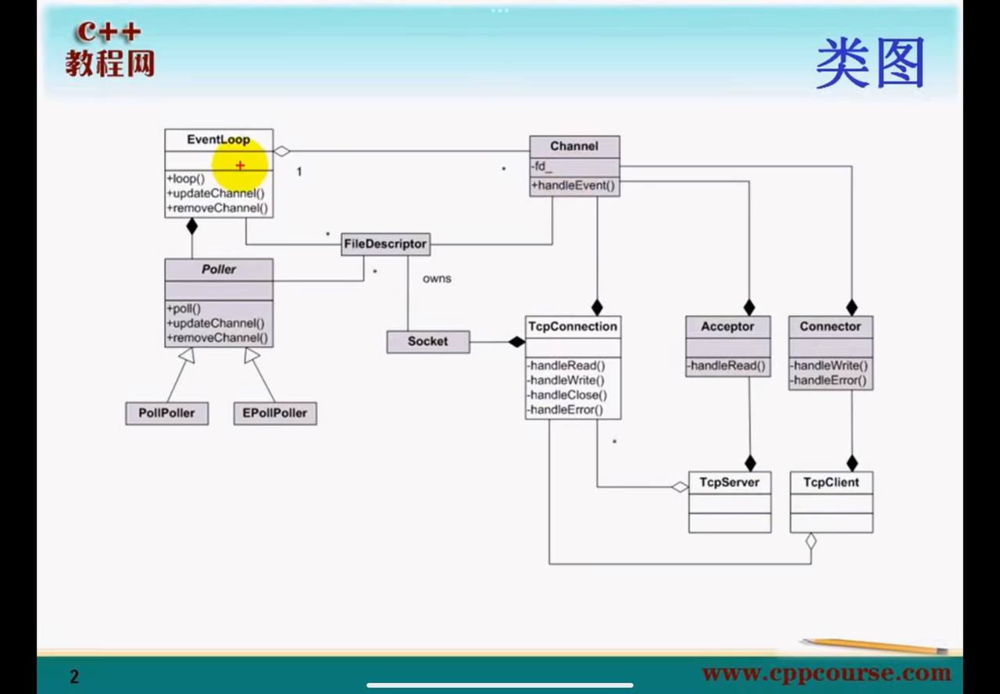

- ==白色部分是外部类，表示对外是可见的，灰色部分表示内部类，表示不可见的==
- EventLoop 是对事件循环的抽象，
    - 一个 EventLoop 拥有多个 fd
- Poller 是对 IO 复用的抽象，
    - pollpoller 是对 poll 的封装
    - Epollpoller 是对 epoll 的封装
- Channel 是对 IO 事件的注册响应的封装
    - EventLoop 不负责 Channel 生存周期的控制，由TcpConnection Acceptor Connector 这些类来控制。
    - Channel 不拥有文件描述符，析构函数发生时，不会 close 文件描述符，与文件描述符只是关联关系。一个 Channel 有一个 fd
    - Channel 同时还是 TcpConnection Acceptor Connector EventLoop TimerQueue TcpConnection 的成员，与这些类的关系同样还是组合。所以生命周期也由后面这些类所控制。
- 文件描述符的生存周期 由 Socket 所拥有。Socket 析构时，套接字也随之销毁。
- Acceptor 是对被动连接的抽象
    - 该类关注的是 监听套接字的可读事件，可读事件由 Channel 来注册， 从而让 Channel 的 handleEvent 函数回调了 handleRead 函数。
- Connector 是对主动连接的抽象
- 被动连接或者主动连接建立之后，就会有一个新的套接字，而 TcpConnection 就是对已经连接的套接字的抽象。
- Acceptor 是 TcpServer 的一个成员，TcpServer 销毁之后，Acceptor 也随之而销毁。
    - TcpConnection 和 TcpServer 的关系是聚合，一个Tcpserver 可以包含多个 TcpConnection .
    - 但是 TcpServer 不控制 TcpConnection 的生存周期，因为有可能客户端关闭了连接，这时候 TcpConnection 也要随之而销毁，同样的 TcpClient 不负责 TcpConnection 的生命周期。